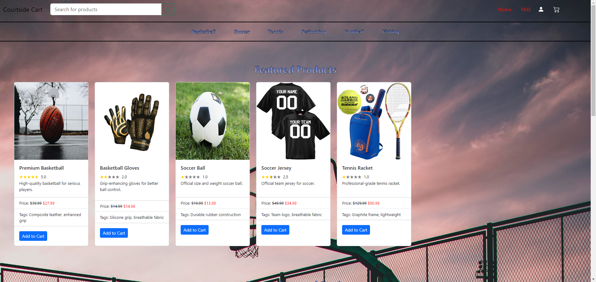
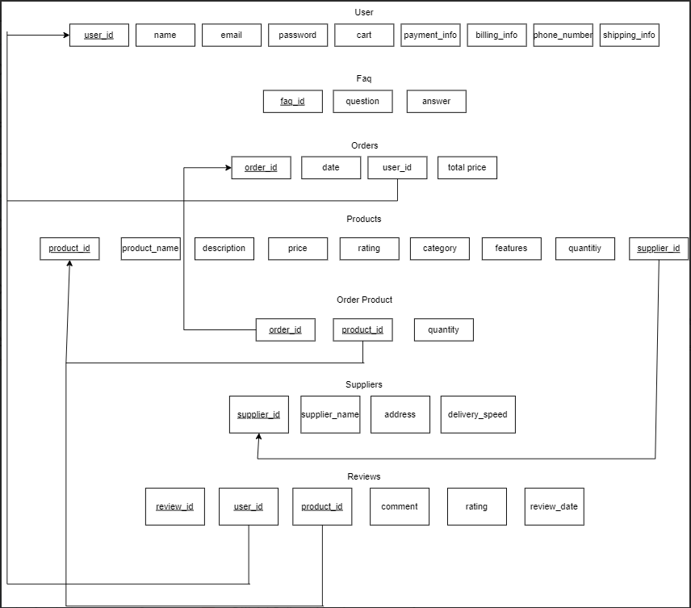

# CourtSide Cart



## Table of Contents

1. [Overview](#overview)
2. [Features](#features)
3. [Technologies](#technologies)
4. [Schema Diagram](#schema-diagram)
5. [Getting Started](#getting-started)
6. [Disclaimer](#disclaimer)
7. [License](#license)

## Overview <a name="overview"></a>

CourtSide Cart is an e-commerce store designed to provide a seamless shopping experience for users interested in sports equipment and accessories. Whether you're a professional athlete or a sports enthusiast, CourtSide Cart has a wide range of products to cater to your needs.

## Features <a name="features"></a>

- **User-friendly Interface**: Intuitive design for a smooth navigation experience.
- **Product Categories**: Organized categories for easy browsing.
- **Responsive Checkout**: Responsive and fast user checkout experience.
- **User Accounts**: Allows users to create accounts for personalized shopping.
- **Search Functionality**: Find products quickly with our efficient search feature.
- **Product Reviews**: Share and read reviews on products to make informed purchasing decisions.

## Technologies <a name="technologies"></a>

CourtSide Cart is built using a variety of technologies, including:

- React.js
- Redux
- Node.js
- Express.js
- AWS Amplify
- AWS RDS
- MySQL
- React Bootstrap
- JWT Authentication
- Nodemailer
- Brycpt

## Schema Diagram <a name="schema-diagram"></a>



## Getting Started <a name="getting-started"></a>

To get started with CourtSide Cart, follow these steps:

1. Clone the repository.

2. Install the Amplify CLI

for NodeJS:
```bash
npm install -g @aws-amplify/cli
```

for Mac/Linux:
```bash
curl -sL https://aws-amplify.github.io/amplify-cli/install | bash && $SHELL
```

for Windows:
```bash
curl -sL https://aws-amplify.github.io/amplify-cli/install-win -o install.cmd && install.cmd
```

3. Connect to Your Own Amplify Environment:

 ```bash
 amplify init
 amplify env checkout <environment-name>
 amplify push  
```
Remember to replace `<environment-name>` with the actual name of your existing Amplify environment.

4. Configure Environment Variables:

Before deploying your backend, configure the following environment variables in AWS Lambda:

Quick guide: 
[](https://youtu.be/znafbn7Wh-o?si=mXcK9OJGS0sLMNGX)

- process.env.SQLHOST: Set the SQL server host.
- process.env.SQLPASS: Set the SQL server password.
- DATABASE_NAME: Set the name of the database (hardcoded but should be an environment variable).
- process.env.SECRET_KEY: Set the secret key.
- process.env.NODEMAILER_PASS: Set the password for NodeMailer.
- process.env.EMAIL_NAME: Set the email name of your nodemailer account.

5. Host the MySQL Database

Don't forget to host the MySQL Database, here is a quick guide on how to do so with AWS: 
[](https://youtu.be/by0EJ4qL8ek?si=s2RPVavnzXMEcvwi)


6. Install the necessary dependencies.
7. Run the application.

```bash
git clone https://github.com/KennethAtchon/Ecommerce-Website-CS442.git
cd Ecommerce-Website-CS442
npm install   
npm start     
```
## Disclaimer <a name="disclaimer"></a>

This project includes links to external resources, such as YouTube videos, for educational purposes. The creators of this project do not claim ownership of the content provided in these external links. Users are advised to review the terms of service, licensing information, and copyright policies of the linked platforms. The inclusion of these links does not imply an endorsement or affiliation with the linked content.

Users should exercise caution and adhere to the policies of external platforms when accessing linked content. The project creators disclaim any responsibility for the content of external resources.


## License <a name="license"></a>

This project is licensed under the [MIT License](LICENSE).
